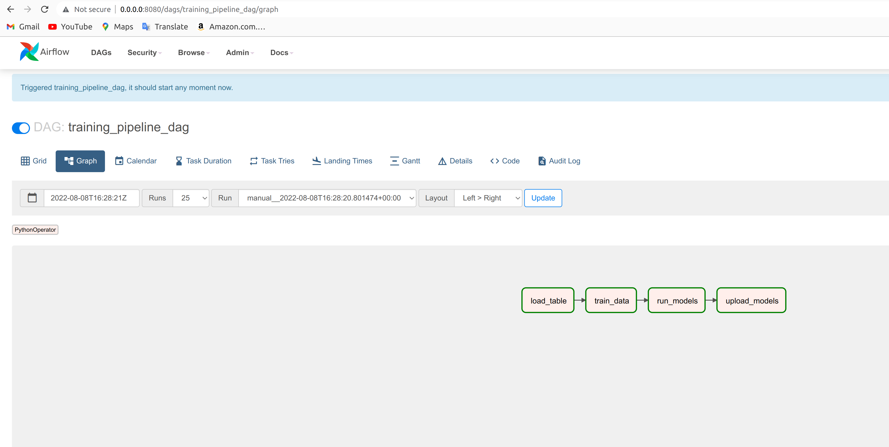
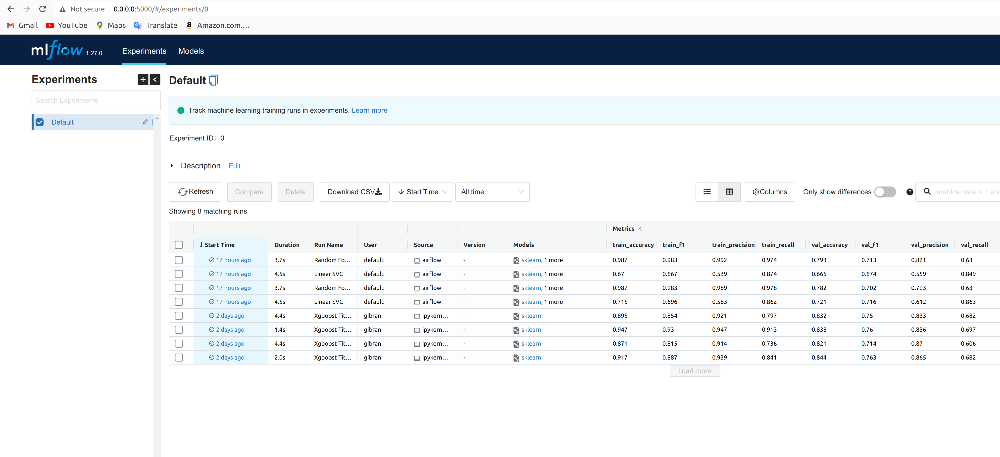
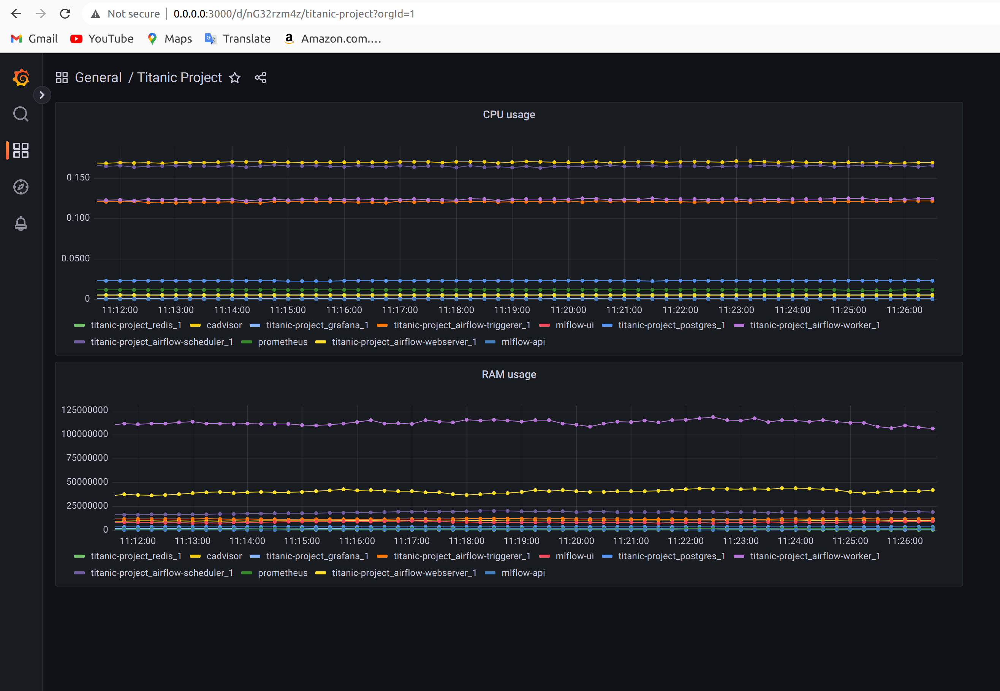

# Titanic Project

This project consists of three parts:

- The execution of an automated pipeline with Airflow and MlFlow.
- And an API in charge of making the predictions.

# Build the mlflow docker container

sudo docker build -t mlflow .

# Run docker-compose 

sudo AWS_ACCESS_KEY_ID='XXXXXXXXXXXXXXXXXXXXXXX' AWS_SECRET_ACCESS_KEY='XXXXXXXXXXXXXXXXXXXXXXXXXX' docker-compose up

# Airflow UI:

0.0.0.0:8080

# MlFlow UI

0.0.0.0:5000

# Test the endpoint:

curl -X POST -H "Content-Type:application/json; format=pandas-split" --data '{"columns":["Age","SibSp","Parch","Fare","C","Q","S","female","male","Class_1","Class_2","Class_3"],"index":[1,2], "data":[[22.0,1,0,66.6,0,0,1,1,0,1,0,0],[30.0,0,1,40,0,0,1,1,0,1,0,0]]}' http://0.0.0.0:5001/invocations

# Monitor with Grafana:

0.0.0.0:3000

